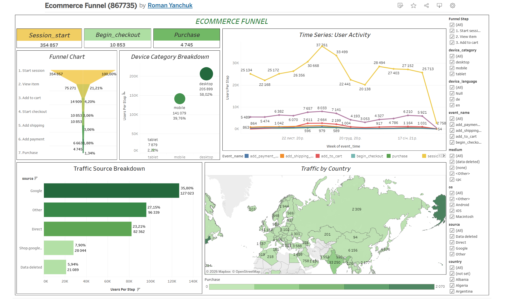

# Ecommerce-funnel-analysis

E-commerce sales funnel analysis using SQL and Tableau

--- 

## Project Overview 

This project analyzes the effectiveness of an e-commerce sales funnel by examining the user journey from the first website visit to a completed purchase.

The goal of the analysis is to identify where users drop off in the funnel and provide data-driven recommendations to improve conversion rates and overall business performance. 
The project combines **SQL data analysis** and **Tableau visualization** to transform raw user activity data into actionable business insights. 

--- 

## Business Context

E-commerce companies typically receive large volumes of website traffic, but not all visitors convert into paying customers. 

**Understanding where users leave the sales funnel is critical for improving:** 
- conversion rates; - marketing efficiency;
- customer experience;
- revenue performance.

This project simulates a real-world analytical task where a data analyst is asked to evaluate the performance of the sales funnel and identify potential optimization opportunities. 

--- 

## Business Problem

An e-commerce company observed stable website traffic but slower revenue growth. Management suspected inefficiencies within the sales funnel but lacked clear visibility into where users were dropping off. 

**The objective of this analysis was to:** 
- Measure conversion rates between funnel stages;
- Identify bottlenecks in the user journey;
- Understand how users progress through the funnel;
- Provide recommendations to improve conversions.

--- 

## Project Objectives 

**The main objectives of this analysis were:** 
- Analyze user progression through the sales funnel;
- Calculate conversion rates between funnel stages;
- Identify bottlenecks in the user journey;
- Visualize funnel performance;
- Provide business recommendations to improve conversions.

--- 

## Sales Funnel Stages 

**The analysis focuses on the following stages:** 
1. Visit;
2. Product View;
3. Add to Cart;
4. Purchase.

Tracking these stages helps evaluate user behavior and identify opportunities to optimize the customer journey. 

--- 

## Data Source 

**The dataset contains user interaction events from an e-commerce website, including:** 
- website visits;
- product page views;
- cart actions;
- purchases.

Each event represents a step in the user journey through the sales funnel. 

**Dataset file:** 
[data/general_request_sample.csv](data/general_request_sample.csv)

---

## Tools & Technologies 

**The following tools were used in this project:** 
- **SQL (BigQuery)** – data extraction and funnel calculations;
- **Tableau** – dashboard and data visualization;
- **GitHub** – project documentation and version control.

--- 

## SQL Analysis 

SQL queries were used to extract user activity events and calculate the number of users at each stage of the funnel. 

**Key analysis tasks performed using SQL:** 
- Identifying funnel stages from event data;
- Counting distinct users at each stage;
- Calculating conversion rates;
- Preparing aggregated data for visualization.

**Example SQL snippet:**

```
WITH session_data AS (
    SELECT 
        user_pseudo_id, 
        (SELECT value.int_value FROM UNNEST(event_params) WHERE key = 'ga_session_id') AS session_id,  
        traffic_source.source AS source,
        traffic_source.medium AS medium, 
        traffic_source.name AS campaign,  
        device.category AS device_category, 
        device.language AS device_language,  
        device.operating_system AS os, 
        geo.country AS country  
    FROM `bigquery-public-data.ga4_obfuscated_sample_ecommerce.events_*`
    WHERE event_name = 'session_start'  
),

event_data AS (
    SELECT 
        user_pseudo_id,  
        (SELECT value.int_value FROM UNNEST(event_params) WHERE key = 'ga_session_id') AS session_id,  
        CONCAT(user_pseudo_id, '-', CAST((SELECT value.int_value FROM UNNEST(event_params) WHERE key = 'ga_session_id') AS STRING)) AS user_session_id, 
        event_name, ...
```

**Full SQL query available in:** 
[Full SQL query](sql/funnel_analysis.sql) 

--- 

## Dashboard 

An interactive Tableau dashboard was created to visualize funnel performance and highlight user drop-off points. 

**Dashboard Preview**: 
 

**Interactive version:** https://public.tableau.com/shared/8NGS4XKX7?:display_count=n&:origin=viz_share_link 

--- 

## Funnel Metrics 

**Key metrics analyzed in this project:** 
| Funnel Stage |  Users   |Conversion Rate | 
|--------------|----------|----------------| 
| Visits       | 354 857  |    100,00 %    | 
| Product Views| 75 271   |     21,21 %    | 
| Add to Cart  | 14 909   |      4,20 %    | 
| Purchases    | 4 745    |      1,34 %    | 

Conversion rates were calculated between each stage to identify where users leave the funnel.

Overall Visit: 354 857 → Purchase conversion rate: 1,34 % (that is 4 745 purchases).

---

## Key Insights 

**Main findings from the analysis:** 
- A significant drop-off occurs between Product View and Add to Cart;
- Some traffic sources generate high traffic but lower conversion rates;
- Mobile users may experience higher friction during checkout;
- Identifying bottlenecks in the funnel can help improve overall sales performance.

--- 

## Recommendations 

**Based on the analysis, the following improvements are recommended:** 
- Optimize product page UX to increase add-to-cart conversion;
- Improve the checkout experience, especially on mobile devices;
- Focus marketing budget on high-converting traffic sources;
- Run campaigns during peak engagement hours.

 ---

## Repository Structure

```
ecommerce-funnel-analysis
│
├── README.md
│
├── data
│   └── general_request3.csv
│
├── sql
│   └── funnel_analysis.sql
│
└── images
    └── dashboard.png
```
    
**Description of folders:** 
- **data/** – dataset used for analysis;
- **sql/** – SQL queries used to calculate funnel metrics;
- **images/** – dashboard screenshots;
- **README.md** – project documentation.

---

## Skills Demonstrated 

**This project demonstrates the following data analytics skills:** 
- SQL data analysis; - Funnel analysis;
- Conversion rate analysis;
- Data visualization;
- Business insight generation;
- Analytical problem solving.

--- 

## Author 

**Roman Yanchuk** 

Aspiring Data Analyst 

**Tools:** SQL | Tableau | Excel | BigQuery

**GitHub:** https://github.com/CodeCrafter-25
